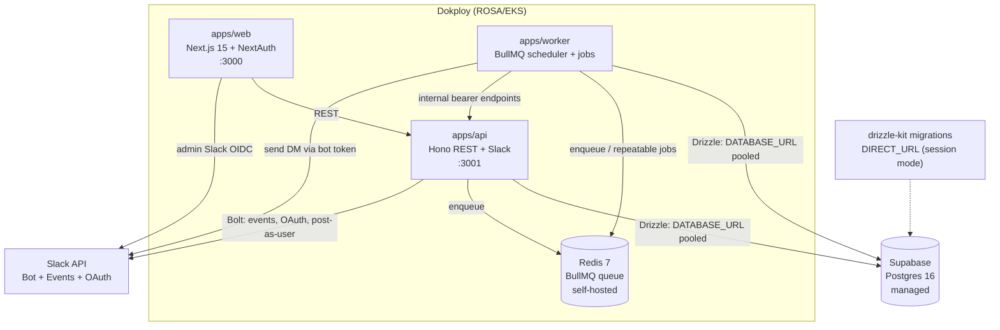

# Architecture Diagram

poddaily Phase 1 runtime topology. Context:
[system overview](../02_architecture/system-overview.md).

Notes:
- Postgres is **external** (Supabase) — not a container.
- Runtime queries use the pooled `DATABASE_URL`; migrations use the direct `DIRECT_URL`.
- `web`, `api`, `worker`, `redis` are the only deployed containers.
