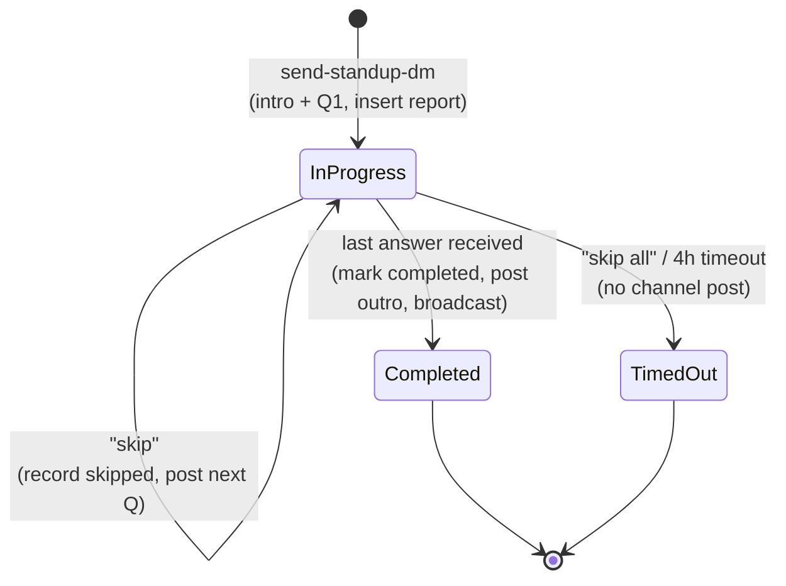

# DM State Machine

Per-member conversational standup. State is reconstructed from Postgres on each event
([stateless DM ADR](../03_decisions/2026-06-14-stateless-dm-state.md)). Context:
[slack integration](../02_architecture/slack-integration.md#dm-qa-engine).

Key points:
- Current question index = number of entries already in `answers`.
- `Completed` triggers the channel broadcast (post-as-user).
- `TimedOut` (from `skip all` or the 4-hour sweeper) **never** posts to the channel.
- Reconstruction makes redelivered events idempotent.
