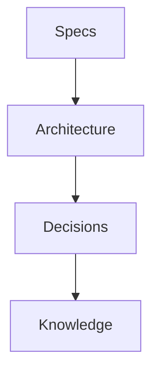

# ContextDB

This folder is a **context database** managed by **ContextLoom**, a local-first macOS app for writing, organizing, and traversing contextual knowledge as plain Markdown files.

ContextDB is designed to be a **single, durable source of project context** — readable and writable by:
- Humans (via ContextLoom or any text editor)
- LLM tools (Claude Code, Cursor, agents, automations)

There is no proprietary format.
The filesystem **is the source of truth**.

---

## What is ContextLoom?

ContextLoom is a calm, Ulysses-style Markdown editor focused on:

- Writing and organizing context alongside your code
- Browsing and searching files in a sidebar tree
- Live Markdown preview with Mermaid diagrams
- Linking related context across files
- Exporting **Context Bundles** — selected files bundled for use in LLM prompts

Everything is stored as plain `.md` files. Nothing is hidden, locked, or rewritten automatically.

---

## Purpose of ContextDB

ContextDB exists to keep **important thinking close to the work**:

- Specs and requirements
- Architecture explanations
- Decisions and tradeoffs
- Reusable knowledge
- Prompts and agent instructions
- Diagrams
- Logs and summaries

Instead of scattering context across chats, docs, and tools, ContextDB provides a **stable place** where context accumulates over time.

---

## Recommended Folder Taxonomy (Agent-Optimized)

You may organize files however you want, but the following structure is **recommended** for predictable traversal by humans and LLMs:

```
ContextDB/
├─ README.md          ← this file
├─ 00_index/          ← entry points, overviews, maps
├─ 01_specs/          ← what should exist (requirements)
├─ 02_architecture/   ← how it works (implementation)
├─ 03_decisions/      ← why choices were made (ADRs)
├─ 04_knowledge/      ← reusable concepts & explanations
├─ 05_prompts/        ← reusable LLM prompts
├─ 06_agents/         ← agent roles, rules, memory
├─ 07_diagrams/       ← Mermaid diagrams
├─ 08_logs/           ← time-ordered summaries & outputs
└─ 99_scratch/        ← drafts and temporary thinking
```

### Why numeric prefixes?
- Preserve intentional ordering
- Improve scanability
- Make traversal predictable for agents
- Avoid ambiguity when listing directories

---

## Folder Semantics (Important)

| Folder | Purpose |
|------|--------|
| `00_index/` | Start here. Maps, overviews, curated entry points |
| `01_specs/` | Intended behavior, PRDs, requirements |
| `02_architecture/` | System design, data flow, components |
| `03_decisions/` | Decision records and tradeoffs |
| `04_knowledge/` | Stable concepts reused across the project |
| `05_prompts/` | Prompt templates and system instructions |
| `06_agents/` | Agent definitions, constraints, memory |
| `07_diagrams/` | Visual context (Mermaid only) |
| `08_logs/` | Append-only logs, summaries, runs |
| `99_scratch/` | Drafts and exploratory notes |

---

## File Conventions

- All files must be UTF-8 Markdown (`.md`)
- Prefer **small, composable files**
- Use descriptive filenames (avoid `notes.md`)
- Date-prefix files when chronology matters:
```
2026-02-07-auth-decision.md
```
- Include a `# Title` heading at the top of every file
- Use relative Markdown links to connect context:
```md
See [Auth Architecture](../02_architecture/auth.md)
```

---

## Markdown & Diagrams

ContextDB supports:

* Standard Markdown (CommonMark)
* Code blocks
* Tables
* Task lists
* Mermaid diagrams

### Mermaid example



Each diagram file should ideally contain **one primary diagram**.

---

## Source Control

**Commit this directory to your repository.**

Benefits:

* Version history for decisions and specs
* Diffs when context changes
* Shared understanding across collaborators
* Context evolves alongside code

Use normal commits or dedicated documentation commits — both are valid.

---

## Using ContextDB with Claude Code

If you use Claude Code or similar tools, add the following snippet to your project's `Claude.md` (or `CLAUDE.md`) at the repository root:

```md
## ContextDB — Project context repository

This project uses a `ContextDB/` directory (managed by ContextLoom) as a local context repository. It is the **canonical place** for all long-lived project context.

### Folder Taxonomy

ContextDB/
├─ README.md          ← ContextDB overview (do not modify)
├─ 00_index/          ← Entry points, overviews, maps
├─ 01_specs/          ← Requirements, PRDs, feature specs
├─ 02_architecture/   ← System design, data flow, components
├─ 03_decisions/      ← Architecture Decision Records (ADRs), tradeoffs
├─ 04_knowledge/      ← Reusable concepts & explanations
├─ 05_prompts/        ← Reusable LLM prompts & system instructions
├─ 06_agents/         ← Agent roles, rules, memory
├─ 07_diagrams/       ← Mermaid diagrams (one per file)
├─ 08_logs/           ← Append-only logs, session summaries, changelogs
├─ 99_scratch/        ← Drafts, temporary thinking, WIP notes
└─ todos/             ← TODO lists and task tracking

Numeric prefixes preserve intentional ordering and make traversal predictable.

### Routing — Where to put things

When the user asks you to save, update, or generate context, route to the correct folder:

| User says | Target folder | Example filename |
|---|---|---|
| "save/update the PRD", "write a spec", "document requirements" | `01_specs/` | `neuromint-prd.md`, `export-feature-spec.md` |
| "document the architecture", "explain how X works" | `02_architecture/` | `auth-flow.md`, `ingestion-pipeline.md` |
| "record this decision", "why did we choose X", "create an ADR" | `03_decisions/` | `2026-02-07-prisma-downgrade.md` |
| "save this knowledge", "document this pattern" | `04_knowledge/` | `stripe-webhook-patterns.md` |
| "save this prompt", "store the system prompt", "save latest prompt" | `05_prompts/` | `code-review-prompt.md` |
| "save agent config", "store agent instructions" | `06_agents/` | `categorization-agent.md` |
| "create a diagram", "draw this flow" | `07_diagrams/` | `onboarding-flow.mmd.md` |
| "save a summary", "log this session", "store context", "update context" | `08_logs/` | `2026-02-07-session-summary.md` |
| "jot this down", "scratch notes", "draft" | `99_scratch/` | `billing-ideas.md` |
| "create a todo", "track these tasks" | `todos/` | `2026-02-07-refactor-tasks.md` |
| "update the index", "add an overview" | `00_index/` | `project-map.md` |

### Reading context
- Before starting work, check `ContextDB/` for relevant notes, decisions, and specs
- Read `ContextDB/README.md` to understand folder structure and conventions
- Check `00_index/` for project maps and entry points
- Check for existing files before creating new ones (prefer appending)

### Writing context
- Route files to the correct taxonomy folder (see table above)
- Use descriptive filenames — date-prefix when chronology matters: `2026-02-07-auth-decision.md`
- Always **append** to existing files rather than overwriting, unless explicitly instructed
- Do **not** delete files without explicit user permission
- Create taxonomy folders on first use if they don't exist yet

### Conventions
- Plain Markdown only (`.md`)
- Include a `# Title` heading in every file
- Use relative links to reference other files: `[see spec](../01_specs/export-spec.md)`
- Prefer **small, composable files** over large monoliths
- Do not create files outside `ContextDB/` without user permission
```

---

## For LLM Tools (General Rules)

### Allowed by default

* Read any file in this directory
* Create new Markdown files here
* Append new sections to existing files

### Requires explicit user permission

* Deleting files
* Overwriting existing content
* Creating non-Markdown files
* Modifying files outside `ContextDB/`

### Best practices

1. Read this README before writing
2. Check for existing related files
3. Prefer linking over duplicating context
4. Append rather than replace
5. Keep changes additive and explain intent

---

ContextDB is meant to **accumulate understanding over time**.
Treat it as shared memory — not a scratchpad.